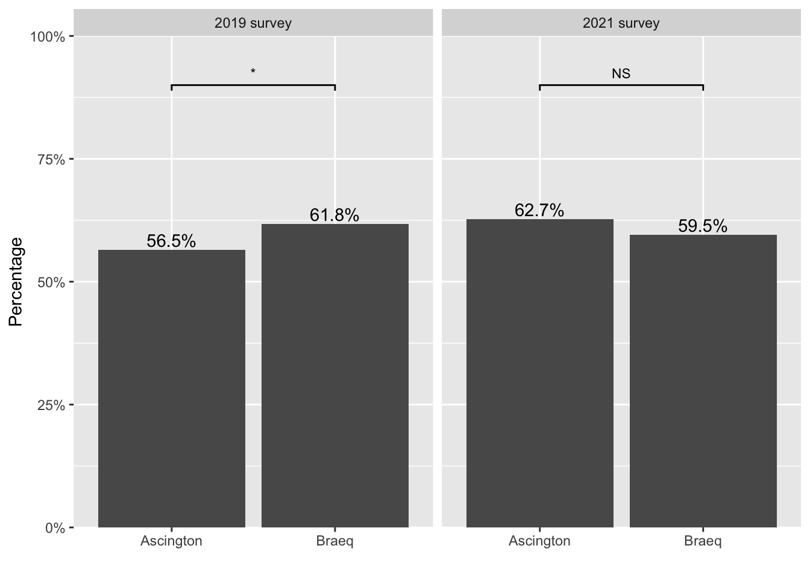
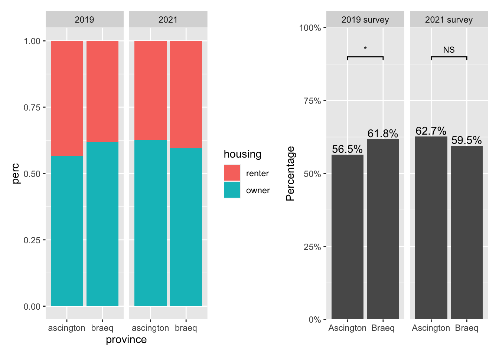
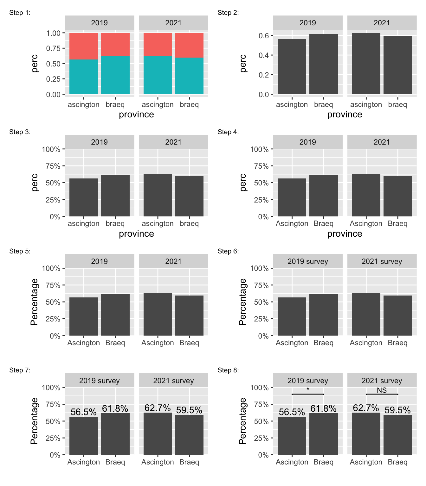

This blog is the first one of a series that documents
what I have learned at work while analyzing data from a few national surveys lately.
Instead of using the actual survey data,
I have simulated them to demonstrate the core problem
while keeping the unnecessary details minimal.

## Home ownership

A household well-being survey was administered every couple of years
in two provinces, Ascington and Braeq [^1].
One question on the survey was "Do you currently own or rent your home?"
Figure [1](#housing-figure) shows the results from the most recent two waves of the survey.

[^1]: factitious names generated using 
[this website](https://www.fantasynamegenerators.com/country_names.php).




Starting from left panel, results based on the 2019 survey suggest that
there were more home owners in Braeq than in Ascington.
Moving on to the right panel, by 2021, the gap between the two provinces
seemed to have disappeared, if not reversed.
<!-- This change is mainly driven by an increased percentage of home owners -->
This change is mainly driven by a growing number of home owners
in Ascington over the past two years,
and a slightly decreased percentage of home owners in Braeq
during the same time period.
<!-- as indicated by the bottom two panels. -->

<!-- Remaining questions in this type of analysis: -->
<!-- when I split the data by `year` or `province`, -->
<!-- do I need to calculate new weights for each sub-sample? -->
<!-- I suppose I could also group data on `housing` 
and run a chisq on `year + province`. -->

To understand how Figure [1](#housing-figure) is created,
let's first peak at the data underneath the figure.
If you want to follow along, run `chunk 1` to access the demo data.


```r 
# chunk 1 (run this to access the demo data)
sim_survey <- dget("https://github.com/chunyunma/chunyunma-dot-me/blob/main/static/txt/housing.txt")
```

`chunk 2` reduces the original data into a contingency table
based on which Figure [1](#housing-figure) was made.


```r 
# chunk 2
sim_survey_srvy <- sim_survey |>
  srvyr::as_survey(weights = weight)

ownership <- sim_survey_srvy |>
  dplyr::group_by(year, province, housing) |>
  dplyr::summarize(perc = srvyr::survey_mean(),
    freq = dplyr::n()) |>
  dplyr::select(-perc_se)

owndership
```


```
# A tibble: 8 × 5
# Groups:   year, province [4]
  year  province  housing  perc  freq
  <fct> <fct>     <fct>   <dbl> <int>
1 2019  ascington renter  0.435   535
2 2019  ascington owner   0.565   684
3 2019  braeq     renter  0.382   482
4 2019  braeq     owner   0.618   776
5 2021  ascington renter  0.373   480
6 2021  ascington owner   0.627   787
7 2021  braeq     renter  0.405   506
8 2021  braeq     owner   0.595   750
```

<!-- Re-arranging it in a more classic view of contingency table in Table x. -->
Now we are ready to plot.




```r 
step1 <- ggplot2::ggplot(
  data = ownership,
  ggplot2::aes(x = province, y = perc, fill = housing)) +
  ggplot2::geom_col() +
  ggplot2::facet_wrap(~ year)
```

The data underlying both panels in Figure [2](#step1-figure) are identical.
However, they look different.
Figure [3](#steps-figure) illustrates how to construct the final product from Figure 2 (left)
step by step.


```r 
step2 <- ownership |>
  dplyr::filter(housing == "owner") |>
  ggplot2::ggplot(
    ggplot2::aes(x = province, y = perc)) +
  ggplot2::geom_col() +
  ggplot2::facet_wrap(~ year)

step3 <- step2 +
  ggplot2::scale_y_continuous(
    labels = scales::percent_format(accuracy = 1),
    limits = c(0, 1),
    expand = c(0, 0)
  )

step4 <- step3 +
  ggplot2::scale_x_discrete(
    labels = c(
      "ascington" = "Ascington",
      "braeq" = "Braeq")
  )

step5 <- step4 +
  ggplot2::labs(x = "", y = "Percentage")


survey_name <- ggplot2::as_labeller(c(
      "2019" = "2019 survey",
      "2021" = "2021 survey")
  )

step6 <- step5 +
  ggplot2::facet_wrap(~ year, labeller = survey_name)

step7 <- step6 +
  ggplot2::geom_text(
    ggplot2::aes(label = scales::percent(perc, accuracy = 0.1)),
    position = ggplot2::position_dodge(width = 0.9), vjust = -0.25)

annotation_df <- sim_survey |>
dplyr::group_by(year) |>
tidyr::nest() |>
dplyr::mutate(model = purrr::map(
    data,
    function(data = data) {
      srvyr::as_survey(.data = data, weights = weight) |>
      srvyr::svychisq(formula = ~ province + housing)
    }),
  tidy = purrr::map(model, broom::tidy)
  ) |>
tidyr::unnest(tidy)

p_star <- function(p) {
  symbol <- dplyr::case_when(
    p <= 0.05 ~ "*",
    TRUE ~ "NS")
  return(symbol)
}

step8 <- step7 +
  ggsignif::geom_signif(
    data = annotation_df,
    xmin = "ascington",
    xmax = "braeq",
    y_position = 0.9,
    vjust = -0.2,
    textsize = 3,
    ggplot2::aes(annotations = p_star(p.value)),
    manual = TRUE
  )
```



To recap, 

```r 
# contingency-table
ownership <- sim_survey_srvy |>
  dplyr::group_by(year, province, housing) |>
  dplyr::summarize(perc = srvyr::survey_mean(),
    freq = dplyr::n()) |>
  dplyr::select(-perc_se)

# chisq for annotation
annotation_df <- sim_survey |>
dplyr::group_by(year) |>
tidyr::nest() |>
dplyr::mutate(model = purrr::map(
    data,
    function(data = data) {
      srvyr::as_survey(.data = data, weights = weight) |>
      srvyr::svychisq(formula = ~ province + housing)
    }),
  tidy = purrr::map(model, broom::tidy)
  ) |>
tidyr::unnest(tidy)

# plot
ownership |>
  dplyr::filter(housing == "owner") |>
  ggplot2::ggplot(ggplot2::aes(x = province, y = perc)) +
    ggplot2::geom_col() +
    ggplot2::facet_wrap(~ year, labeller = survey_name) +
    ggplot2::scale_x_discrete(
      labels = c(
        "ascington" = "Ascington",
        "braeq" = "Braeq")
      ) +
    ggplot2::scale_y_continuous(
      labels = scales::percent_format(accuracy = 1),
      limits = c(0, 1),
      expand = c(0, 0)
      ) +
    ggplot2::labs(x = "", y = "Percentage") +
    ggplot2::geom_text(
      ggplot2::aes(label = scales::percent(perc, accuracy = 0.1)),
      position = ggplot2::position_dodge(width = 0.9), vjust = -0.25) +
    ggsignif::geom_signif(
      data = annotation_df,
      xmin = "ascington",
      xmax = "braeq",
      y_position = 0.9,
      vjust = -0.2,
      textsize = 3,
      ggplot2::aes(annotations = p_star(p.value)),
      manual = TRUE
    )
```

## Scale up

A typical household survey does not ask just one question.
More likely several dozens of questions.
Consider the following examples:

- Are you currently employed?
- Do you have any financial depedent?
- Do you have any debt?

All of these questions share the same binary structure
as the home ownership question we have seen before.
Presumably, we could re-use the code we have written for the `housing` variable
and create similar figures for new variables.
Or we could write some function!

<!-- You should consider writing a function -->
<!-- whenever you’ve copied and pasted a block of code more than twice -->


