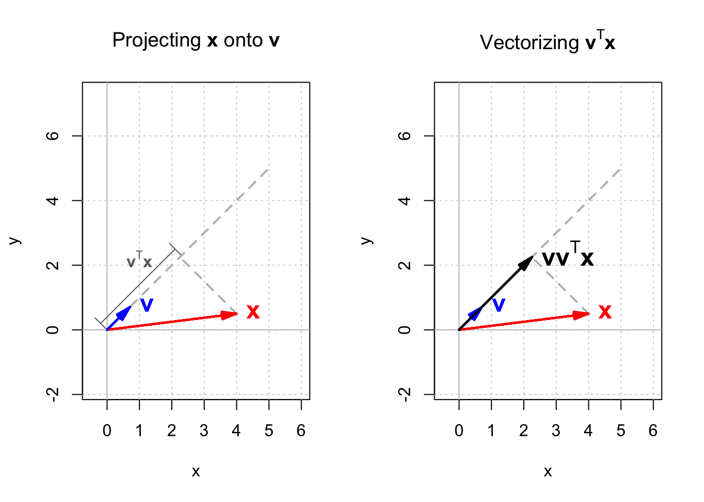

## Geometrical interpretation of eigendecomposition

In the previous [post](),
we showed how to express a symmetric matrix
as the product of three matrices,
a process known as eigendecomposition.
In this post, we revisit this procedure,
but from a geometrical perspective.

To begin, let's assume that a symmetric matrix $\mathbf{A}$ 
has $n$ eigenvectors,
and each eigenvector $\mathbf{u}_i$ is an $n \times 1$ column vector 

$$
\begin{equation*}
  \mathbf{u}_i = 
  \begin{bmatrix}
    u\_{i1} \\\\
    u\_{i2} \\\\
    \vdots \\\\
    u\_{in} \\\\
  \end{bmatrix}
\end{equation*}
$$ 

then the transpose of $\mathbf{u}_i$ is a $1 \times n$ row vector

$$
\begin{equation*}
  \mathbf{u}_i^T = 
  \begin{bmatrix}
    u\_{i1} & u\_{i2} & \ldots & u\_{in} \\\\
  \end{bmatrix}
\end{equation*}
$$ 

and their multiplication

$$
\begin{equation*}
  \mathbf{u}_i\mathbf{u}_i^T = 
  \begin{bmatrix}
    u\_{i1} \\\\
    u\_{i2} \\\\
    \vdots \\\\
    u\_{in} \\\\
  \end{bmatrix}
  \begin{bmatrix}
    u\_{i1} & u\_{i2} & \ldots & u\_{in} \\\\
  \end{bmatrix} = 
  \begin{bmatrix}
    u\_{i1}u\_{i1} & u\_{i1}u\_{i2} & \ldots & u\_{in}u\_{in} \\\\
    u\_{i2}u\_{i1} & u\_{i2}u\_{i2} & \ldots & u\_{i2}u\_{in} \\\\
    \vdots & \vdots & \vdots & \vdots \\\\
    u\_{in}u\_{i1} & u\_{in}u\_{i2} & \ldots & u\_{in}u\_{in} \\\\
  \end{bmatrix}
\end{equation*}
$$ 

becomes an $n \times n$ matrix. 

Let's return to $\mathbf{A} = \mathbf{P}\mathbf{D}\mathbf{P}^\top$. 
First, we calculate $\mathbf{D}\mathbf{P}^\top$ to simplify the eigendecomposition equation:

$$
\begin{align*}
  \begin{bmatrix}
    \lambda_1 & 0 & \ldots & 0 \\\\
    0 & \lambda_2 & \ldots & 0 \\\\
    \vdots & \vdots & \vdots & \vdots \\\\
    0 & 0 & \ldots & \lambda_n \\\\
  \end{bmatrix}
  \begin{bmatrix}
    \mathbf{u}_1^\top \\\\
    \mathbf{u}_2^\top \\\\
    \ldots \\\\
    \mathbf{u}_n^\top \\\\
  \end{bmatrix} &= 
  \begin{bmatrix}
    \lambda_1 & 0 & \ldots & 0 \\\\
    0 & \lambda_2 & \ldots & 0 \\\\
    \vdots & \vdots & \vdots & \vdots \\\\
    0 & 0 & \ldots & \lambda_n \\\\
  \end{bmatrix}
  \begin{bmatrix}
    u\_{11} & u\_{12} & \ldots & u\_{1n} \\\\
    u\_{21} & u\_{22} & \ldots & u\_{2n} \\\\
    \vdots & \vdots & \vdots & \vdots \\\\
    u\_{n1} & u\_{n2} & \ldots & u\_{nn} \\\\
  \end{bmatrix} \\\\
  &= 
  \begin{bmatrix}
    \lambda\_1u\_{11} & \lambda\_1u\_{12} & \ldots & \lambda\_1u\_{1n} \\\\
    \lambda\_2u\_{21} & \lambda\_2u\_{22} & \ldots & \lambda\_2u\_{2n} \\\\
    \vdots & \vdots & \vdots & \vdots \\\\
    \lambda\_nu\_{n1} & \lambda\_nu\_{n2} & \ldots & \lambda\_nu\_{nn} \\\\
  \end{bmatrix} = 
  \begin{bmatrix}
    \lambda_1\mathbf{u}_1^\top \\\\
    \lambda_2\mathbf{u}_2^\top \\\\
    \ldots \\\\
    \lambda_n\mathbf{u}_n^\top \\\\
  \end{bmatrix}
\end{align*}
$$ 

Now the eigendecomposition becomes:

$$
\begin{equation*}
  \mathbf{A} = 
  \begin{bmatrix}
    \mathbf{u}_1 & \mathbf{u}_2 & \cdots & \mathbf{u}_n \\\\
  \end{bmatrix}
  \begin{bmatrix}
    \lambda_1\mathbf{u}_1^\top \\\\
    \lambda_2\mathbf{u}_2^\top \\\\
    \ldots \\\\
    \lambda_n\mathbf{u}_n^\top \\\\
  \end{bmatrix} = 
  \lambda_1\mathbf{u}_1\mathbf{u}_1^\top + \lambda_2\mathbf{u}_2\mathbf{u}_2^\top + \ldots + \lambda_n\mathbf{u}_n\mathbf{u}_n^\top
\end{equation*}
$$ 


Therefore, the $n \times n$ matrix $\mathbf{A}$ can be broken into $n$ matrices 
with the same shape ($n \times n$), 
and each of these matrices has a multiplier 
which is equal to the corresponding eigenvalue $\lambda_i$. 
Each of the matrices $\mathbf{u}_i\mathbf{u}_i^\top$
is called a *projection matrix*.

Imagine that we have a vector $\mathbf{x}$ and a unit vector $\mathbf{v}$. 
The inner product of $\mathbf{v}$ and $\mathbf{x}$ which is equal to 
$\mathbf{v} \cdot \mathbf{x} = \mathbf{v}^\top\mathbf{x}$ gives the scalar projection 
of $\mathbf{x}$ onto $\mathbf{v}$, 
which is the length of the vector projection of $\mathbf{x}$ into $\mathbf{v}$. 
If we multiply $\mathbf{v}^\top\mathbf{x}$ by $\mathbf{v}$ again, 
$\mathbf{v}\mathbf{v}^\top\mathbf{x}$ gives a vector which is called the orthogonal projection of $\mathbf{x}$ onto $\mathbf{v}$.
This is shown in Figure [1](#eigendecomposition-figure).




Therefore, when $\mathbf{v}$ is a unit vector, 
multiplying $\mathbf{v}\mathbf{v}^\top$ by $\mathbf{x}$ 
will give the orthogonal projection of $\mathbf{x}$ onto $\mathbf{v}$, 
and that is why $\mathbf{v}\mathbf{v}^\top$ is called the projection matrix. 
Multiplying $\mathbf{u}_i\mathbf{u}_i^\top$ by $\mathbf{x}$, we get the 
orthogonal projection of $\mathbf{x}$ onto $\mathbf{u}_i$. 

Now let's use `R` to calculate the projection matrices of matrix $\mathbf{A}$ 
mentioned before. 

$$
\mathbf{A} = 
\begin{bmatrix}
  3 & 1 \\\\
  1 & 2 \\\\
\end{bmatrix}
$$ 

We had already calculated the eigenvalues and eigenvectors of $\mathbf{A}$. 

```r 
mat_a <- matrix(c(3, 1, 1, 2), 2)
eigen_a <- eigen(mat_a)
eigen_a
```

```
eigen() decomposition
$values
[1] 3.618034 1.381966

$vectors
           [,1]       [,2]
[1,] -0.8506508  0.5257311
[2,] -0.5257311 -0.8506508
```

The next chunk will apply eigendecomposition to $\mathbf{A}$
and print the first term, namely $\mathbf{A}_1$.

```r 
u_a <- eigen_a$vectors # an orthogonal matrix made of A's eigenvectors
lambda_a <- eigen_a$values # a vector of A's eigenvalues
mat_a1 <- lambda_a[1] * u_a[,1] %*% t(u_a[,1])
mat_a1 |> round(3)
```

```
      [,1]  [,2]
[1,] 2.618 1.618
[2,] 1.618 1.000
```

$$
\begin{align*}
  \mathbf{A}_1 &= 
  \lambda_1\mathbf{u}_1\mathbf{u}_1^\top \\\\
  &= 3.618
\begin{bmatrix}
  -0.851 \\\\
  -0.526 \\\\
\end{bmatrix}
\begin{bmatrix}
  -0.851 & -0.526 \\\\
\end{bmatrix} =
\begin{bmatrix}
  2.618 & 1.618 \\\\
  1.618 & 1 \\\\
\end{bmatrix}
\end{align*}
$$ 

As you can see, $\mathbf{A}_1$ is also a symmetric matrix.
In fact, 
it can be shown that 
all projection matrices
$\lambda_i\mathbf{u}_i\mathbf{u}_i^\top$ in the eigendecomposition equation
are symmetric.

Other than being symmetric, projection matrices have some interesting properties.
Let's continue with $\mathbf{A}_1$ as an example.
We can calculate its eigenvalues and eigenvectors:

```r 
eigen_a1 <- eigen(mat_a1)
cat("eigenvalues: ", "\n")
ifelse(round(eigen_a1$values, 3) < 0.001, 0, round(eigen_a1$values, 3))
cat("eigenvectors: ", "\n")
eigen_a1$vectors |> round(3)
```

```
eigenvalues:  
[1] 3.618 0.000
eigenvectors:  
       [,1]   [,2]
[1,] -0.851  0.526
[2,] -0.526 -0.851
```

$\mathbf{A}_1$ has two eigenvalues.
One is 0.
The other one is equal to $\lambda_1$ of the orignal matrix $\mathbf{A}$.
In addition, its eigenvectors are identical to that of $\mathbf{A}$.
This is not a coincidence.
To see why, suppose we multiple $\mathbf{A}_1$ by $\mathbf{u}_1$:

$$
\begin{equation*}
  \mathbf{A}_1\mathbf{u}_1 =
  \left( \lambda_1\mathbf{u}_1\mathbf{u}_1^\top \right)\mathbf{u}_1 =
  \lambda_1\mathbf{u}_1 \left(\mathbf{u}_1^\top\mathbf{u}_1 \right)
\end{equation*}
$$ 

We know that $\mathbf{u}_1$ is an eigenvector and it is normalized.
Therefore, its length is equal to 1,
so is its inner product with itself.
Thus we have:

$$
\begin{equation*}
  \mathbf{A}_1\mathbf{u}_1 =
  \left( \lambda_1\mathbf{u}_1\mathbf{u}_1^\top \right)\mathbf{u}_1 =
  \lambda_1\mathbf{u}_1
\end{equation*}
$$ 

Thus, $\mathbf{u}_1$ is an eigenvector of $\mathbf{A}_1$,
and the corresponding eigenvalue is $\lambda_1$.

Furthermore,

$$
\begin{equation*}
  \mathbf{A}_1\mathbf{u}_2 =
  \left( \lambda_1\mathbf{u}_1\mathbf{u}_1^\top \right)\mathbf{u}_2 =
  \lambda_1\mathbf{u}_1 \left(\mathbf{u}_1^\top\mathbf{u}_2 \right)
\end{equation*}
$$ 

Because $\mathbf{A}$ is symmetric,
its eigenvectors $\mathbf{u}_1$ and $\mathbf{u}_2$ are orthogonal, 
or perpendicular.
Given that the inner product of two perpendicular vectors is zero,
the inner product of $\mathbf{u}_1$ and $\mathbf{u}_2$ is zero.
Thus we have

$$
\begin{equation*}
  \mathbf{A}_1\mathbf{u}_2 =
  \left( \lambda_1\mathbf{u}_1\mathbf{u}_1^\top \right)\mathbf{u}_2 =
  \lambda_1\mathbf{u}_1 \left(\mathbf{u}_1^\top\mathbf{u}_2 \right)
\end{equation*} = 0 = 0 \times \mathbf{u}_2
$$ 

which means that $\mathbf{u}_2$ is also an eigenvector of $\mathbf{A}_1$
and its corresponding eigenvalue is 0,
matching the output of `eigen_a1$values[2]` = 0.


In general,
eigendecomposition decomposes a symmetric matrix
into $n$ of $n \times n$ projection matrices,
$\lambda_i\mathbf{u}_i\mathbf{u}_i^\top$.

Each projection matrix is also symmetric,
which shares the same eigenvectors as the original matrix.
For a particular project matrix $\lambda_k\mathbf{u}_k\mathbf{u}_k^\top$,
the corresponding eigenvalue of eigenvector $\mathbf{u}_k$ 
is the $k$-th eigenvalue of $\mathbf{A}$, $\lambda_k$,
whereas all the remaining eigenvalues are zero.

Recall that a symmetric matrix scales a vector
along its eigenvectors,
proportionally to the corresponding eigenvalue.
Therefore, a projection matrix $\lambda_i\mathbf{u}_i\mathbf{u}_i^\top$
stretches/shrinks a vector along $\mathbf{u}_i$ by $\lambda_i$,
but shrinks the vector to zero in all other directions.
Let's illustrate this with $\mathbf{A}$
and one of its projection matrix $\mathbf{A}_1$ in Figure [2](#projection-figure).

 and transformed vectors by a projection matrix (right).")

All vectors in $\mathbb{X}$ are transformed by $\mathbf{A}_1$,
namely, stretched along $\mathbf{u}_1$ and shrunk to zero along $\mathbf{u}_2$.
As a result, the initial circle became a straight line.
<!-- extending from xx to xx. -->

Previously, matrix $\mathbf{A}$ transformed vectors in $\mathbb{X}$
into an ellipse, another 2-D shape.
And yet, matrix $\mathbf{A}_1$ transformed vectors in $\mathbb{X}$
into a line, a 1-D shape.
Both $\mathbf{A}$ and $\mathbf{A}_1$ are symmetric.
How come one preserves whereas the other reduces the dimension?
In the [next post](),
we will discuss the reason by introducing the concept of *rank*.


